## Sprint 2 - SmartCare

# I have checked and satisfied all tests.
1.	Login to the system (user = "doctor", password= "doctor") and create a Session lasting for 20 minutes.
2.	List all patients and all invoices per selected period (including costs)
3.	List private patients and NHS patients, separately
4.	Add a patient - including all relevant data.
5.	Add doctor or nurse users
6.	Book an appointment with a doctor or a nurse as a patient
7.	Check daily surgery schedule as a doctor or nurse
8.	Issue a prescription if required and an invoice following each surgery including all details
9.	Forward a patient to a hospital or a specialist clinic if need specialist consultation or care.
10.	Calculate turnovers per selected period.  
11.	Let patients pay their bills - only the full total current bill is accepted - no part payment allowed.
12.	Remove a patient from surgery schedule as an admin
13.	Cancel a booked appointment as a patient
14.	Change the prices per service or period of consultation 

# All the screenshots 

# All the jps's
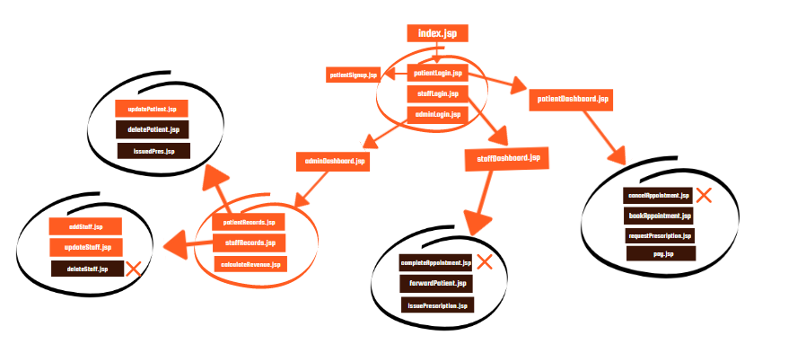

# index.jsp
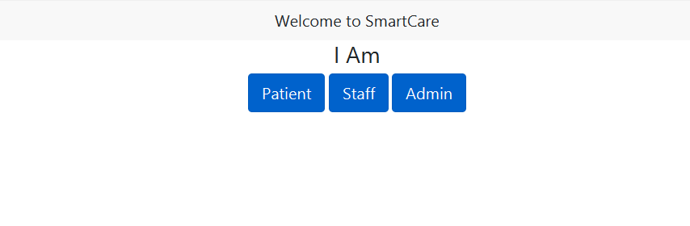

# patientLogin.jsp
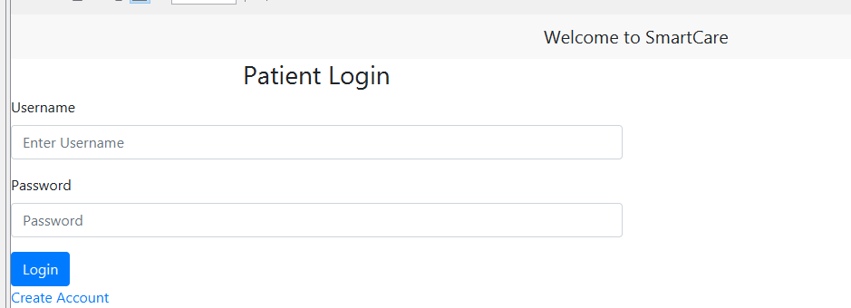

# patientSignup.jsp
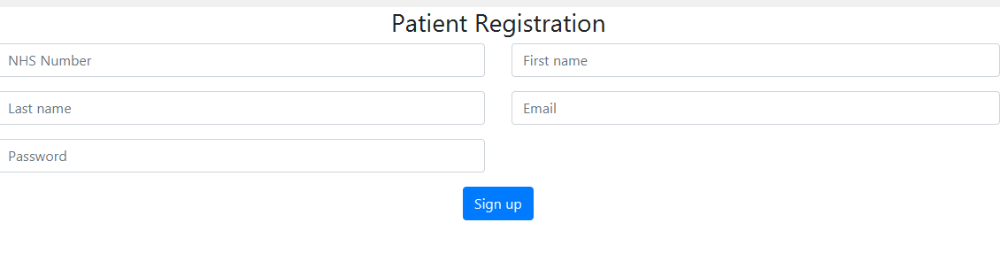

# patientDashboard.jsp
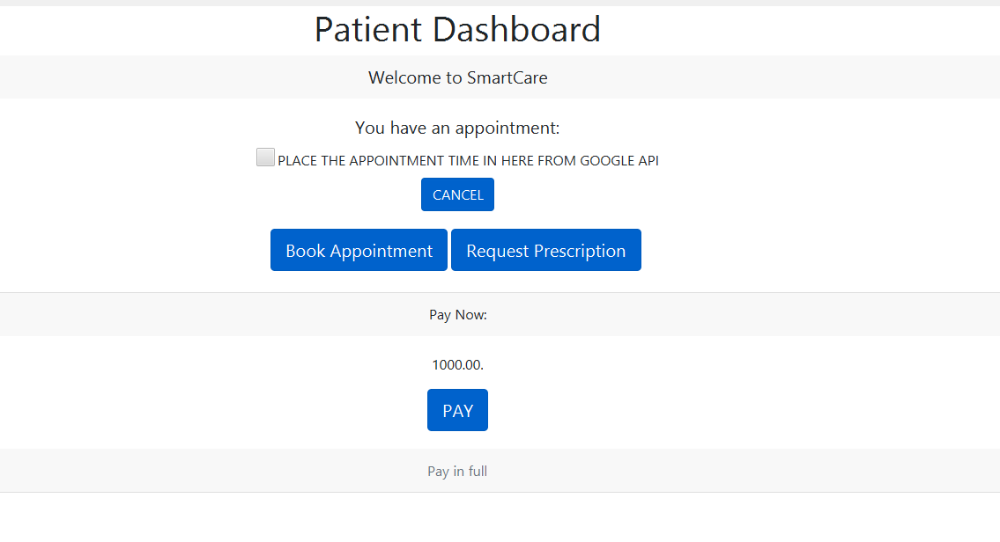

# staffLogin.jsp
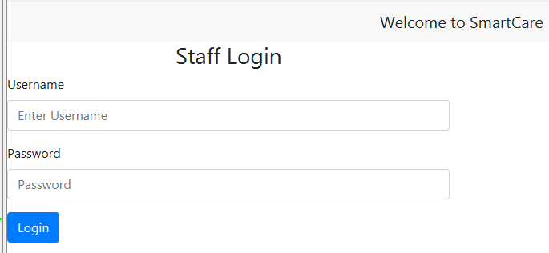

# staffDashboard.jsp
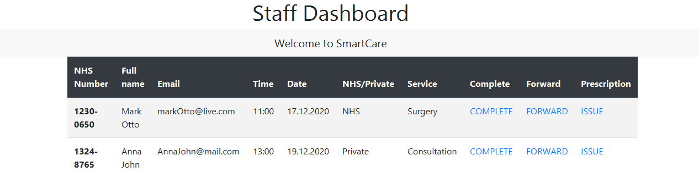

# adminDashboard.jsp
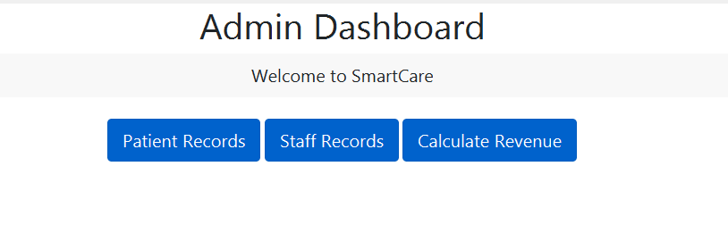

# patientRecords.jsp
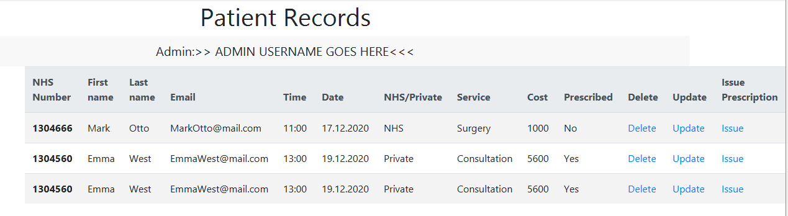

# updatePatient.jsp
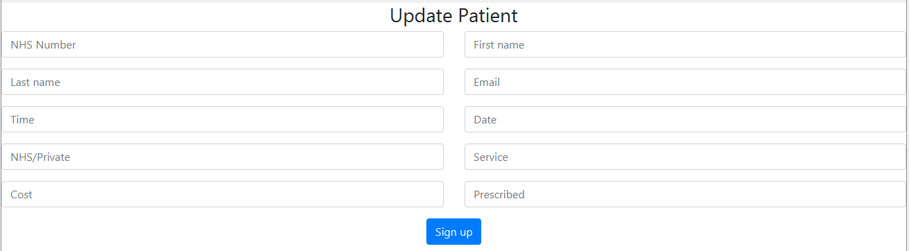

# staffRecords.jsp
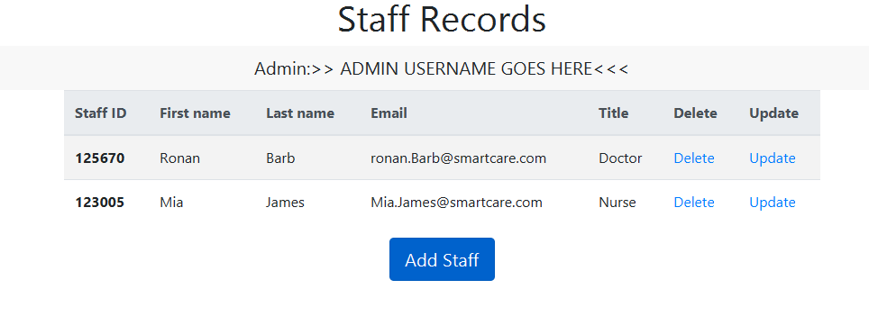

# addStaff.jsp
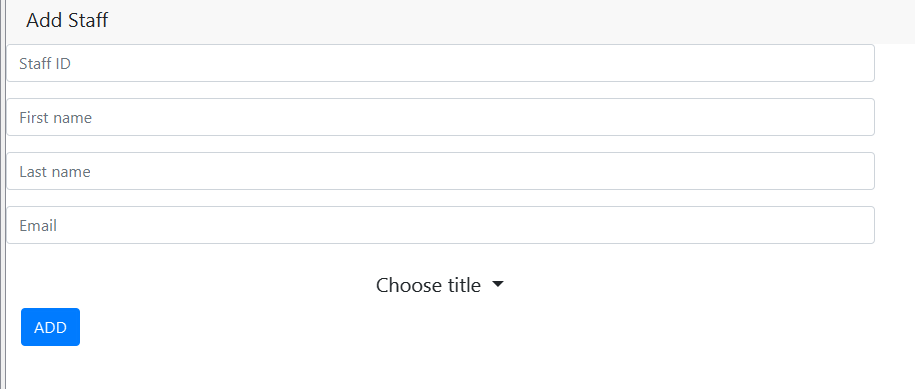

# updateStaff.jsp
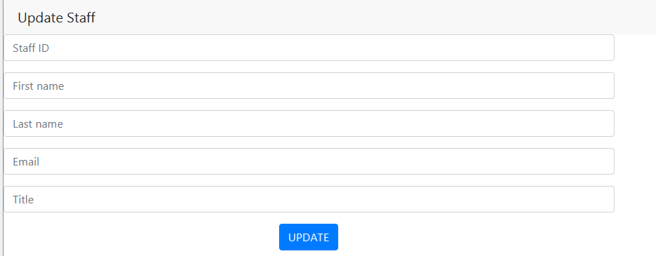

# calcRevenue.jsp
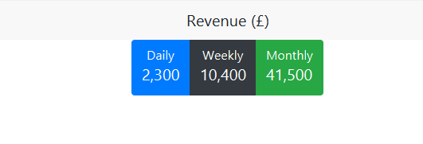
